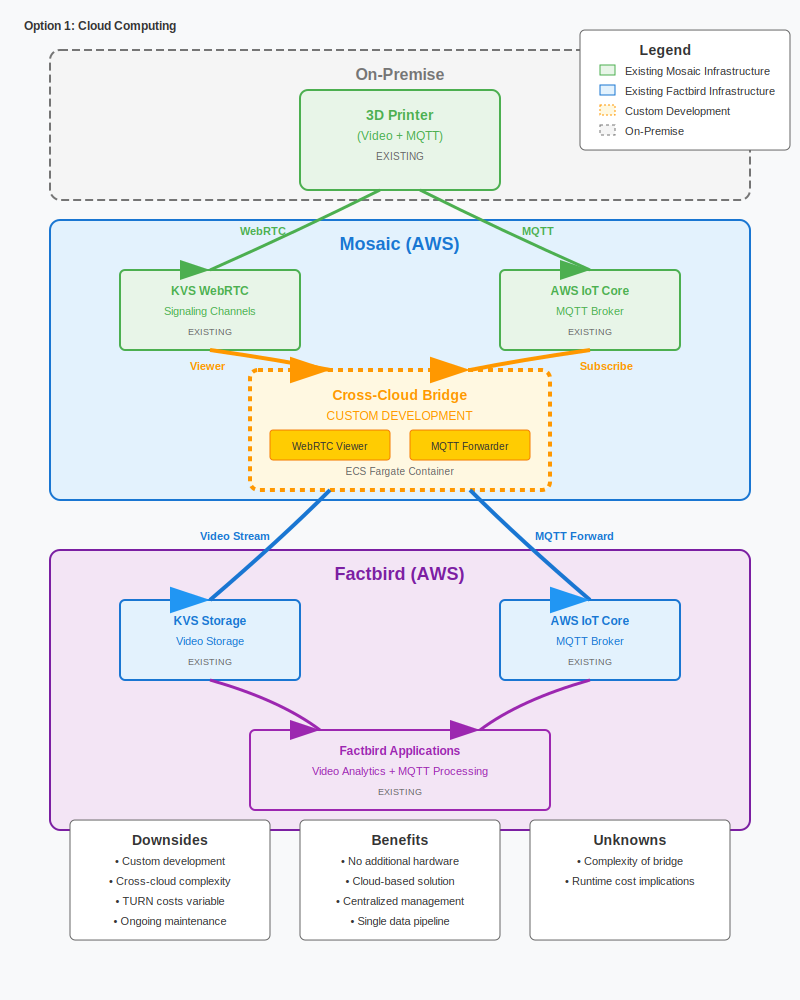
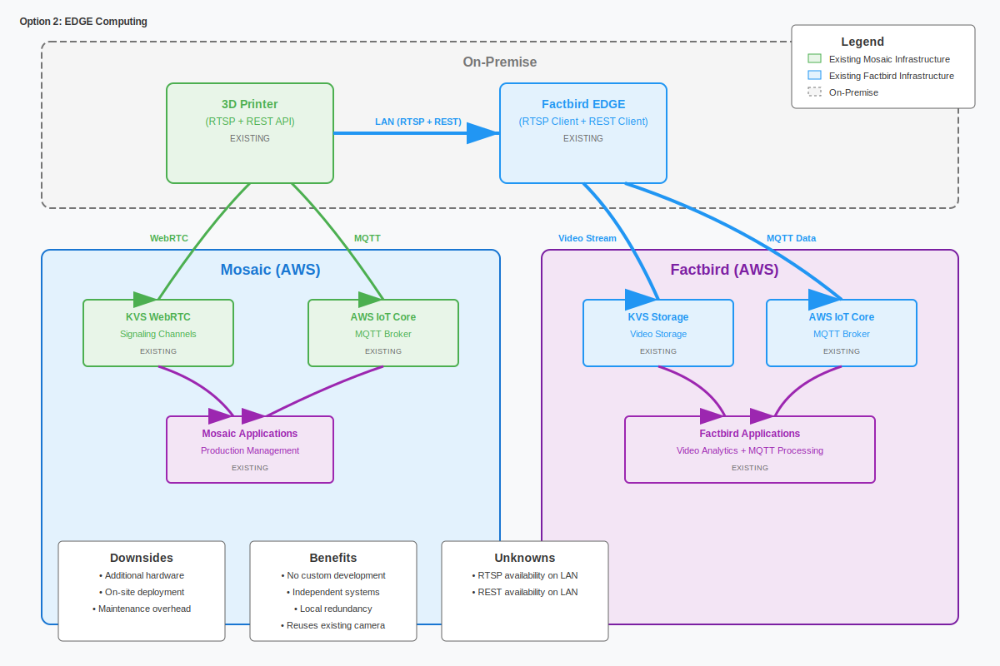
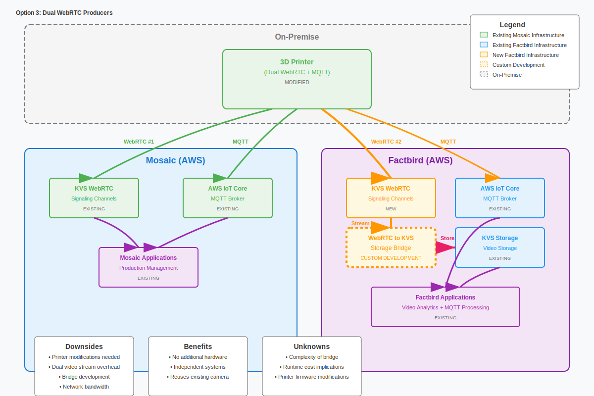
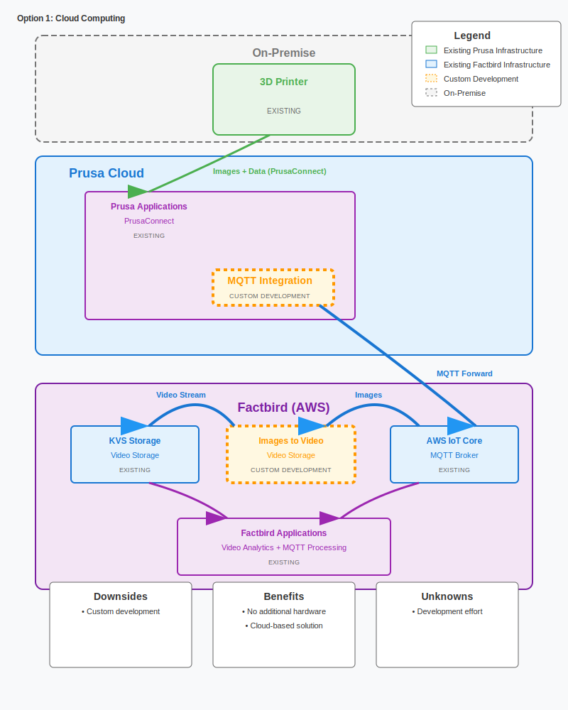
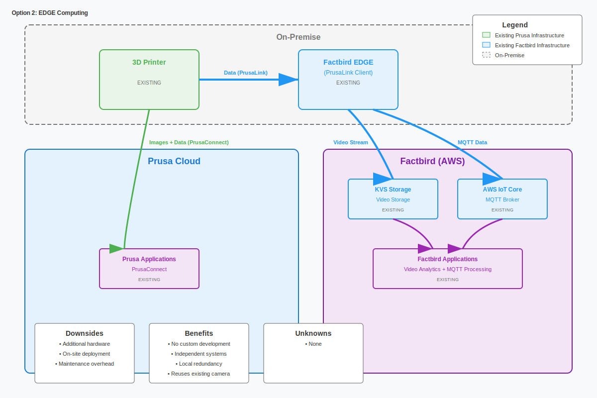

# Mosaic

## Option 1: Cloud Computing Bridge
**What it is:** Mosaic develops and maintains a cloud software component that acts as a translator between their system and Factbird's system.

**Implementation Details:**
- Mosaic builds a custom system that converts video formats for Factbird's cloud storage
- Mosaic handles all development, hosting, and ongoing maintenance
- Creates a direct cloud-to-cloud connection

**Benefits:**
- No new hardware at your facilities
- Centralized cloud management
- Single data pipeline

**Considerations:**
- Development timeline depends on Mosaic's resources and priorities
- Long-term maintenance responsibility lies with Mosaic
- Future updates and support dependent on Mosaic's roadmap

## Option 2: EDGE Computing
**What it is:** Deploy Factbird EDGE devices (small computers) at each printer location to handle local data collection and cloud transmission.

**Implementation Details:**
- Uses existing Factbird hardware currently in their product lineup
- Requires software configuration to connect to printers locally
- Leverages Factbird's existing connected device infrastructure
- Device management, security, and authentication handled by Factbird

**Benefits:**
- Uses established technology from Factbird's existing product suite
- Independent operation between systems
- Local data processing capability
- Factbird manages all technical aspects

**Considerations:**
- Requires hardware purchase and physical installation at each location
- Ongoing hardware maintenance needs
- Additional devices to manage on-site

## Option 3: Dual Video Streaming
**What it is:** Modify each 3D printer to send video streams to both Mosaic and Factbird simultaneously, plus develop cloud translation services.

**Implementation Details:**
- Requires modifying printer software to add new streaming capabilities
- Each printer needs individual setup with Factbird's systems
- Factbird develops and maintains cloud translation components
- Doubles network bandwidth usage per printer

**Benefits:**
- No additional hardware purchase required
- Both systems operate independently
- Utilizes existing camera infrastructure

**Considerations:**
- Involves modifying printer software, which may affect warranties
- Requires coordination between printer manufacturers and Factbird
- Higher network infrastructure requirements
- Multiple integration points across hardware and cloud systems
- Development responsibility falls on Factbird

**Key Factors for Decision:**
- **Development responsibility:** Option 1 (Mosaic), Option 2 (minimal), Option 3 (Factbird)
- **Hardware requirements:** Option 1 (none), Option 2 (new devices), Option 3 (none)
- **Complexity level:** Option 1 (medium), Option 2 (low), Option 3 (high)

---

# Prusa

## Option 1: Cloud Computing Integration
**What it is:** Factbird develops cloud-based software to connect with Prusa's existing cloud platform and convert image snapshots into video streams.

**Implementation Details:**
- Factbird builds integration software to connect with Prusa's cloud platform
- Custom development required to convert 10-second image snapshots into continuous video streams
- Image stitching process creates artificial video from static snapshots
- All integration and data processing happens in the cloud

**Benefits:**
- No new hardware at your facilities
- Cloud-based solution using existing Prusa infrastructure
- Leverages Prusa's existing data connectivity

**Considerations:**
- Requires custom development by Factbird for image-to-video conversion
- Video quality limited by 10-second snapshot intervals
- Ongoing maintenance responsibility for integration software
- Dependent on Prusa's cloud platform availability and changes

## Option 2: EDGE Computing Integration
**What it is:** Deploy Factbird EDGE devices at each printer location to collect snapshot data locally and convert it to video streams for cloud transmission.

**Implementation Details:**
- Uses existing Factbird EDGE hardware from their current product suite
- Connects directly to printers using Prusa's local data interface (PrusaLink)
- Converts 10-second snapshots to video streams locally on the device
- Handles all authentication and data transmission to Factbird's cloud

**Benefits:**
- Uses established Factbird hardware and infrastructure
- Independent operation from Prusa's cloud services
- Local processing capability
- Option to add real video cameras later if desired
- Works with existing printer connections

**Considerations:**
- Requires hardware purchase and physical installation at each location
- Ongoing device maintenance needs
- Video quality still limited by 10-second snapshot intervals (unless upgraded with real cameras)

**Unique Advantage for Option 2:**
Unlike cloud-only integration, the EDGE device provides the flexibility to upgrade video quality later by adding actual video cameras on-site, eliminating the 10-second snapshot limitation if continuous video becomes important for your operations.

**Key Technical Note:**
Both options face the same limitation of working with 10-second image snapshots from Prusa printers, which will result in lower quality "video" compared to true continuous streaming.

**Key Factors for Decision:**
- **Development responsibility:** Option 1 (Factbird), Option 2 (minimal - uses existing products)
- **Hardware requirements:** Option 1 (none), Option 2 (new devices per printer)
- **Complexity level:** Option 1 (medium), Option 2 (low)
